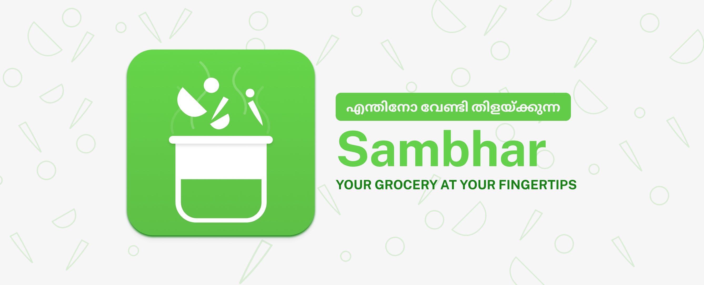

# Sambhar

P2P marketplace for groceries during the Corona lockdown.

# Intro

Sambhar is designed as a platform to meet the demand and supply between consumers and sellers by bringing them to a common platform.

The app does this by creating an easy to use dashboard where users can order items from the vendors around them.

The app shows all the essentials available from their nearby vendors and lets them choose the amount required.

Once the items are added to the cart, the consumer gets an alert on the number of orders placed on his dashboard.

Consumers dashboard also shows the amount of inventory left, so that he can keep in check that he is not running too much out of the essentials.

At this first phase, we haven't implemented the delivery service and has built the app with the consideration that the delivery will be managed by the seller as Government approval is needed for commuting under Corona lockdown circumstances. But it would be the straightforward next step to implement a delivery service inside this application to do the delivery management.

# Design

Here is the  where we conducted all of our designs.

## Visual language

## Palette

## Typography

## Icons

## UI Flow

# Development

App is developed using Flutter on the frontend as it allows for compiling down to iOS, Android, and Web in one go and Firebase for the backend operations. This helps considerably in broadening the reach and allows for fast iteration times.

## Getting Started

If you are interested in contributing to this application. We will add the DFD, database schema, and architectural decisions about the app here soon.

## DFD

## Data Schema

## Architecture
